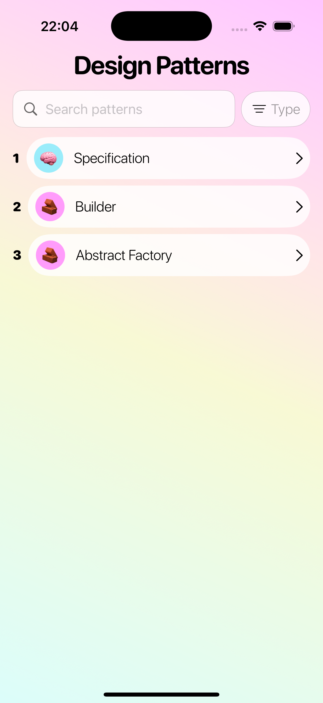
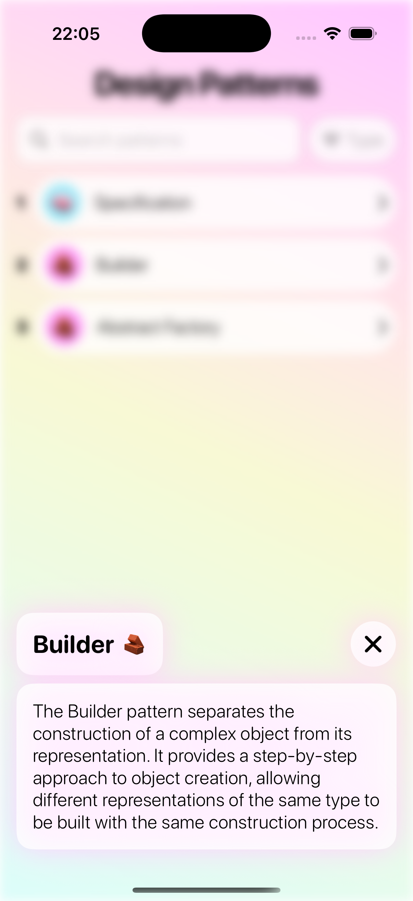

# DesignPatterns App (SwiftUI + Clean Architecture) - currently WIP

This is a demo iOS application built with **SwiftUI** that demonstrates the **real-world use of software design patterns** in a clean, modular architecture.

The application was created with the goal of showcasing:
- Practical usage of **creational**, **structural**, and **behavioral** design patterns
- Clean, testable architecture with clear separation of concerns
- Scalable data layer with support for multiple data sources
- Async data flow and Swift concurrency in SwiftUI

> All the patterns listed in the UI are **actually implemented in the codebase** and govern the core architecture of the app.

---

## ✨ Features

- 📋 **List of software design patterns**, categorized by type
- 🚦 **State-driven UI** using a generic `UIState<T>` enum
- 🚀 Fully **asynchronous logic** using `async/await`
- 🎯 SwiftUI + MVVM + DI-ready
- 💡 Custom overlay with animation to display pattern details
- 🎨 Visual styling based on pattern type (emoji, color, icon)

---

## 🧩 Design Patterns Applied in Codebase

| Pattern              | Type         | Where It’s Used                                                  |
|----------------------|--------------|------------------------------------------------------------------|
| **Builder**          | Creational   | Constructing `DesignPattern` models safely and incrementally     |
| **Abstract Factory** | Creational   | Switching between mock and API data sources                      |
| **Specification**    | Behavioral   | Filtering patterns by name/type with composable specifications   |

You can find all patterns in action inside:
- `UseCase/`, `Repositories/`, `Specifications/`, and `Utilities/` folders.

---

## 🧪 Preview of UI

  
  

---

## 🛠 Technologies Used

- Swift 5.10
- SwiftUI
- MVVM
- Swift Concurrency (`async/await`)
- Dependency Inversion & Protocol-Oriented Design

